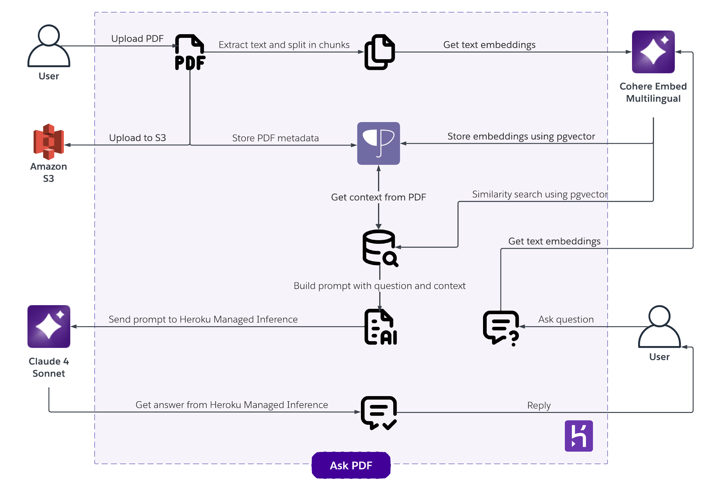

# Ask PDF

[](https://www.heroku.com/deploy?template=https://github.com/heroku-reference-apps/ask-pdf)

Ask questions to a PDF file using [Retrieval-Augmented Generation](https://arxiv.org/abs/2005.11401) with pgvector and Heroku Managed Inference and Agents.



## Requirements

- Node.js LTS (>v20.9.0) - We recommend using [Volta](http://volta.sh) as version manager.
- An [Heroku](https://signup.heroku.com/) account
- [Heroku CLI](https://devcenter.heroku.com/articles/heroku-cli)
- PostgreSQL [psql](https://www.postgresql.org/download/) client
- [AWS Command Line Interface](https://aws.amazon.com/cli/)
- [pnpm](https://pnpm.io/installation)

## Installation

Install dependencies by running:

```sh
npm install
```

Create an Heroku application with:

```sh
heroku create <app-name>
```

Provision the [Heroku Postgres with pgvector addon](https://elements.heroku.com/addons/heroku-postgresql):

```sh
 heroku addons:create heroku-postgresql:essential-0
```

Provision the [Heroku Managed Inference and Agents add-ons](https://elements.heroku.com/addons/heroku-inference):

**Claude 4 Sonnet** for inference and **Cohere Embed Multilingual** for embeddings.

```sh
 heroku ai:models:create claude-4-sonnet --as INFERENCE
```

```sh
 heroku ai:models:create cohere-embed-multilingual --as EMBEDDING
```

Provision the [Bucketeer addon](https://elements.heroku.com/addons/bucketeer):

```sh
 heroku addons:create bucketeer:hobbyist
```

Once the PostgreSQL database is created, setup the database schema with:

```sh
heroku pg:psql -f data/database.sql
```

Setup Bucketeer public policy, make sure to replace `<bucket-name>` and run:

```sh
aws s3api put-public-access-block --bucket <bucket-name> --public-access-block-configuration BlockPublicAcls=FALSE,IgnorePublicAcls=FALSE,BlockPublicPolicy=FALSE,RestrictPublicBuckets=FALSE
```

Create a policy.json file and replace `<bucket-name>`.

```json
{
  "Version": "2012-10-17",
  "Statement": [
    {
      "Sid": "PublicReadGetObject",
      "Effect": "Allow",
      "Principal": "*",
      "Action": ["s3:GetObject"],
      "Resource": ["arn:aws:s3:::<bucket-name>/public/*"]
    }
  ]
}
```

Then run the following, replacing `<bucket-name>`:

```sh
aws s3api put-bucket-policy --bucket <bucket-name> --policy file://policy.json
```

Note: To run the `aws` commands you need to configure your credentials first by running:

```sh
aws configure
```

## Run in Development

Create a `.env` file with the following information, you can use `.env.sample` as a template:

```sh
BUCKETEER_AWS_ACCESS_KEY_ID=<value>
BUCKETEER_AWS_REGION=us-east-1
BUCKETEER_AWS_SECRET_ACCESS_KEY=<value>
BUCKETEER_BUCKET_NAME=<value>
DATABASE_URL=<value>
EMBEDDING_KEY=<value>
EMBEDDING_MODEL_ID=cohere-embed-multilingual
EMBEDDING_URL='https://us.inference.heroku.com'
INFERENCE_KEY=<value>
INFERENCE_MODEL_ID=claude-4-sonnet
INFERENCE_URL='https://us.inference.heroku.com'
```

Note: This configuration variables can be fetched from Heroku using:

```sh
heroku config --shell > .env
```

Run the project locally with:

```sh
pnpm run dev
```

## Manual Deployment

To manually deploy to Heroku you can run:

```sh
git push heroku main
```
